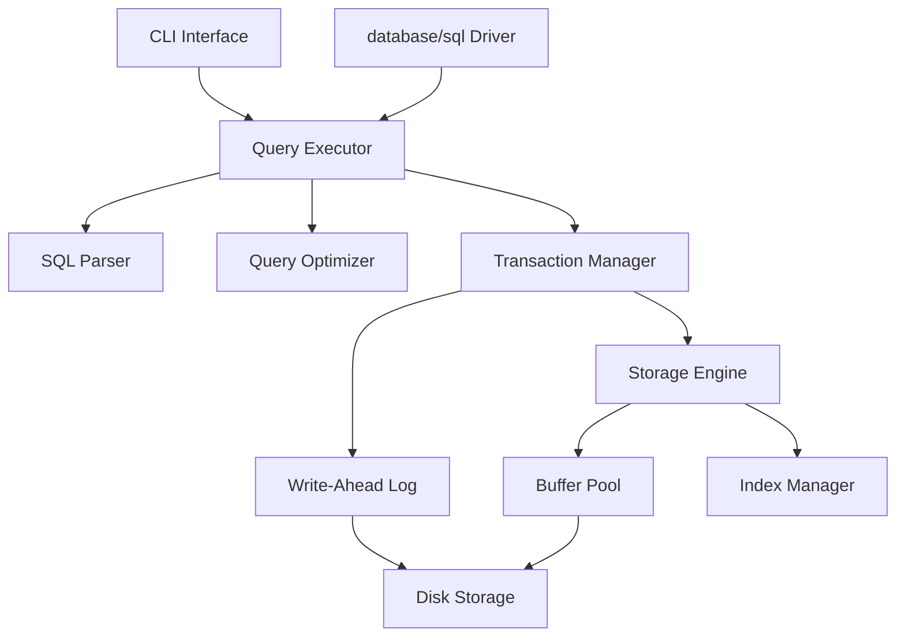

# Cool DB Design Document

## Overview

Cool DB is a SQL database engine implemented in Go that provides a complete relational database management system. The system is designed around a B+ tree-based storage engine with ACID transaction support, write-ahead logging, and a standard SQL interface. The architecture emphasizes correctness, data integrity, and performance through efficient disk I/O and memory management.

The system consists of several key components: a storage engine with B+ tree indexes, a transaction manager with WAL support, a SQL parser and query executor, a buffer pool for memory management, and both CLI and database/sql driver interfaces for user interaction.

## Architecture

### High-Level Architecture



### Component Layers

1. **Interface Layer**: CLI and database/sql driver for user interaction
2. **Query Processing Layer**: SQL parser, query optimizer, and executor
3. **Transaction Layer**: Transaction manager with ACID guarantees
4. **Storage Layer**: B+ tree storage engine with indexing
5. **Buffer Management Layer**: Memory management and disk I/O optimization
6. **Persistence Layer**: Write-ahead logging and disk storage

## Components and Interfaces

### Storage Engine

**Purpose**: Manages data storage using B+ trees for efficient access patterns.

**Key Interfaces**:
```go
type StorageEngine interface {
    Insert(tableID TableID, key []byte, value []byte) error
    Delete(tableID TableID, key []byte) error
    Get(tableID TableID, key []byte) ([]byte, error)
    Scan(tableID TableID, startKey, endKey []byte) (Iterator, error)
    CreateTable(schema TableSchema) (TableID, error)
    DropTable(tableID TableID) error
}

type BPlusTree interface {
    Insert(key, value []byte) error
    Delete(key []byte) error
    Search(key []byte) ([]byte, error)
    RangeScan(startKey, endKey []byte) Iterator
    Split() error
    Merge() error
}
```

**Design Rationale**: B+ trees provide O(log n) search performance and efficient range scans through sequential leaf node traversal. The separation of storage engine interface allows for future storage implementations while maintaining API compatibility.

### Transaction Manager

**Purpose**: Provides ACID transaction guarantees through coordination with WAL and concurrency control.

**Key Interfaces**:
```go
type TransactionManager interface {
    Begin() (Transaction, error)
    Commit(txn Transaction) error
    Rollback(txn Transaction) error
    GetIsolationLevel() IsolationLevel
}

type Transaction interface {
    GetID() TransactionID
    GetStartTime() time.Time
    IsActive() bool
    AddOperation(op Operation)
    GetOperations() []Operation
}

type LockManager interface {
    AcquireReadLock(resource ResourceID, txn TransactionID) error
    AcquireWriteLock(resource ResourceID, txn TransactionID) error
    ReleaseLocks(txn TransactionID) error
    DetectDeadlock() ([]TransactionID, error)
}
```

**Design Rationale**: The transaction manager coordinates with the lock manager for concurrency control and the WAL for durability. Separating lock management allows for different locking strategies and deadlock detection algorithms.

### Write-Ahead Log (WAL)

**Purpose**: Ensures durability and enables crash recovery through ordered logging of all modifications.

**Key Interfaces**:
```go
type WAL interface {
    WriteLogRecord(record LogRecord) (LSN, error)
    Flush() error
    Recover() error
    Checkpoint() error
    GetLSN() LSN
}

type LogRecord interface {
    GetType() LogRecordType
    GetTransactionID() TransactionID
    GetLSN() LSN
    Serialize() []byte
    Deserialize([]byte) error
}
```

**Design Rationale**: WAL ensures that all changes are logged before being applied (write-ahead property). The LSN (Log Sequence Number) provides ordering and enables efficient recovery. Checkpointing reduces recovery time by establishing consistent recovery points.

### Index Manager

**Purpose**: Manages secondary indexes for query optimization and constraint enforcement.

**Key Interfaces**:
```go
type IndexManager interface {
    CreateIndex(tableID TableID, columns []string, indexType IndexType) (IndexID, error)
    DropIndex(indexID IndexID) error
    InsertEntry(indexID IndexID, key []byte, rowID RowID) error
    DeleteEntry(indexID IndexID, key []byte, rowID RowID) error
    Search(indexID IndexID, key []byte) ([]RowID, error)
    RangeScan(indexID IndexID, startKey, endKey []byte) (Iterator, error)
}
```

**Design Rationale**: Separate index management allows for different index types (B+ tree, hash) and maintains consistency between table data and indexes. The interface supports both unique and non-unique indexes through the RowID slice return type.

### SQL Parser and Query Executor

**Purpose**: Parses SQL statements and executes them through the storage and transaction layers.

**Key Interfaces**:
```go
type Parser interface {
    Parse(sql string) (Statement, error)
    Validate(stmt Statement) error
}

type QueryExecutor interface {
    Execute(stmt Statement, txn Transaction) (ResultSet, error)
    ExecuteDDL(stmt DDLStatement) error
    ExecuteDML(stmt DMLStatement, txn Transaction) (ResultSet, error)
}

type QueryOptimizer interface {
    Optimize(stmt Statement) (ExecutionPlan, error)
    EstimateCost(plan ExecutionPlan) float64
    GenerateAlternativePlans(stmt Statement) ([]ExecutionPlan, error)
}
```

**Design Rationale**: Separating parsing, optimization, and execution allows for modular development and testing. The optimizer can generate multiple plans and select the lowest-cost option based on statistics and index availability.

### Buffer Pool

**Purpose**: Manages memory-resident pages to minimize disk I/O through intelligent caching.

**Key Interfaces**:
```go
type BufferPool interface {
    GetPage(pageID PageID) (*Page, error)
    PinPage(pageID PageID) (*Page, error)
    UnpinPage(pageID PageID, isDirty bool) error
    FlushPage(pageID PageID) error
    FlushAll() error
    EvictPage() error
}

type Page interface {
    GetID() PageID
    GetData() []byte
    IsDirty() bool
    SetDirty(dirty bool)
    GetPinCount() int
    IncrementPinCount()
    DecrementPinCount()
}
```

**Design Rationale**: The buffer pool uses a pin/unpin mechanism to prevent eviction of actively used pages. LRU eviction policy balances memory usage with access patterns. Dirty page tracking ensures data consistency during eviction.

### Schema Manager

**Purpose**: Manages table schemas, constraints, and metadata persistence.

**Key Interfaces**:
```go
type SchemaManager interface {
    CreateTable(schema TableSchema) error
    DropTable(tableName string) error
    GetTableSchema(tableName string) (TableSchema, error)
    AddConstraint(tableName string, constraint Constraint) error
    ValidateConstraints(tableName string, row Row) error
}

type TableSchema interface {
    GetName() string
    GetColumns() []ColumnSchema
    GetPrimaryKey() []string
    GetConstraints() []Constraint
    ValidateRow(row Row) error
}
```

**Design Rationale**: Schema management is separated to handle DDL operations and constraint validation independently. This allows for schema evolution and constraint checking without coupling to storage implementation.

## Data Models

### Core Data Structures

**Page Structure**:
```go
type Page struct {
    Header   PageHeader
    Data     []byte
    Checksum uint32
}

type PageHeader struct {
    PageID      PageID
    PageType    PageType
    FreeSpace   uint16
    RecordCount uint16
    NextPage    PageID
    PrevPage    PageID
}
```

**B+ Tree Node**:
```go
type BPlusTreeNode struct {
    Header   NodeHeader
    Keys     [][]byte
    Values   [][]byte  // For leaf nodes
    Children []PageID  // For internal nodes
}

type NodeHeader struct {
    IsLeaf      bool
    KeyCount    uint16
    Parent      PageID
    NextLeaf    PageID
    PrevLeaf    PageID
}
```

**Transaction Log Record**:
```go
type LogRecord struct {
    LSN           LSN
    Type          LogRecordType
    TransactionID TransactionID
    PageID        PageID
    Offset        uint16
    Length        uint16
    OldData       []byte
    NewData       []byte
    Timestamp     time.Time
}
```

**Design Rationale**: Fixed-size headers enable efficient parsing and navigation. Variable-length data sections accommodate different record sizes. Checksums ensure data integrity detection.

### Type System

**Supported Data Types**:
- `INTEGER`: 64-bit signed integers
- `VARCHAR(n)`: Variable-length strings up to n characters
- `TEXT`: Unlimited-length strings
- `BOOLEAN`: True/false values
- `FLOAT`: 64-bit floating-point numbers
- `DOUBLE`: Alias for FLOAT

**Type Conversion Rules**:
- Implicit conversions between numeric types (INTEGER ↔ FLOAT)
- Explicit casting required for string to numeric conversions
- Boolean values: TRUE/FALSE, 1/0, 't'/'f'

## Error Handling

### Error Categories

1. **Syntax Errors**: Invalid SQL syntax, parsing failures
2. **Semantic Errors**: Invalid table/column references, type mismatches
3. **Constraint Violations**: Primary key, foreign key, check constraint failures
4. **Concurrency Errors**: Deadlocks, lock timeouts
5. **Storage Errors**: Disk I/O failures, corruption detection
6. **Transaction Errors**: Rollback conditions, isolation violations

### Error Recovery Strategies

**Transaction Rollback**: Automatic rollback on constraint violations or deadlocks
**WAL Recovery**: Replay committed transactions and undo uncommitted ones after crashes
**Corruption Detection**: Checksum validation with repair recommendations
**Graceful Degradation**: Continue operation with reduced functionality when possible

### Error Interfaces

```go
type DatabaseError interface {
    error
    GetCode() ErrorCode
    GetSeverity() ErrorSeverity
    GetContext() map[string]interface{}
    IsRetryable() bool
}

type ErrorCode int
const (
    ErrSyntaxError ErrorCode = iota
    ErrConstraintViolation
    ErrDeadlock
    ErrDiskFull
    ErrCorruption
)
```

## Testing Strategy

### Unit Testing

**Component-Level Tests**:
- B+ tree operations (insert, delete, search, split, merge)
- Transaction manager (begin, commit, rollback, isolation)
- WAL operations (write, flush, recovery)
- Buffer pool management (pin, unpin, eviction)
- SQL parser (valid/invalid syntax, AST generation)

**Test Coverage Goals**:
- 90%+ code coverage for core components
- Edge cases: empty trees, full buffers, concurrent access
- Error conditions: disk failures, memory exhaustion, corruption

### Integration Testing

**Cross-Component Tests**:
- End-to-end transaction processing
- Crash recovery scenarios
- Concurrent transaction execution
- Index maintenance during DML operations
- Query optimization with various data distributions

**Performance Tests**:
- Throughput under concurrent load
- Memory usage patterns
- Disk I/O efficiency
- Query response times with different data sizes

### System Testing

**CLI Interface Tests**:
- Interactive command execution
- Batch script processing
- Error message clarity
- Meta-command functionality

**Driver Compatibility Tests**:
- database/sql interface compliance
- Connection pooling behavior
- Prepared statement performance
- Transaction isolation levels

**Stress Testing**:
- High-concurrency workloads
- Large dataset operations
- Memory pressure scenarios
- Long-running transaction behavior

### Test Data Management

**Synthetic Data Generation**:
- Configurable dataset sizes
- Various data distributions (uniform, skewed, clustered)
- Realistic workload patterns

**Regression Test Suite**:
- Automated test execution on code changes
- Performance regression detection
- Compatibility verification across Go versions

**Design Rationale**: Comprehensive testing ensures correctness and performance under various conditions. The multi-layered approach catches issues at different integration levels, while automated testing enables continuous validation during development.