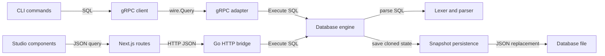
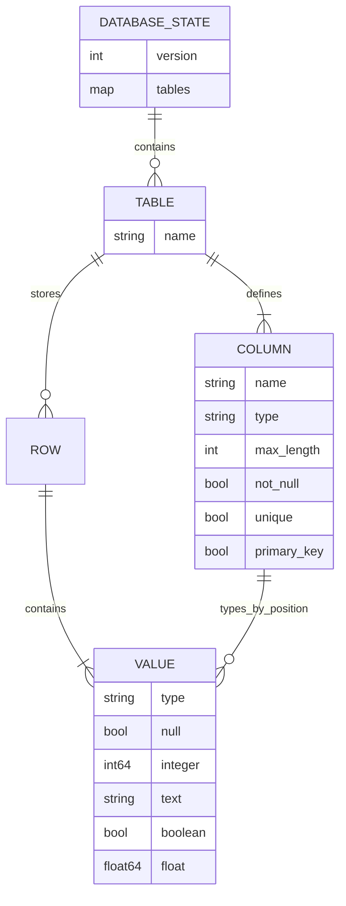
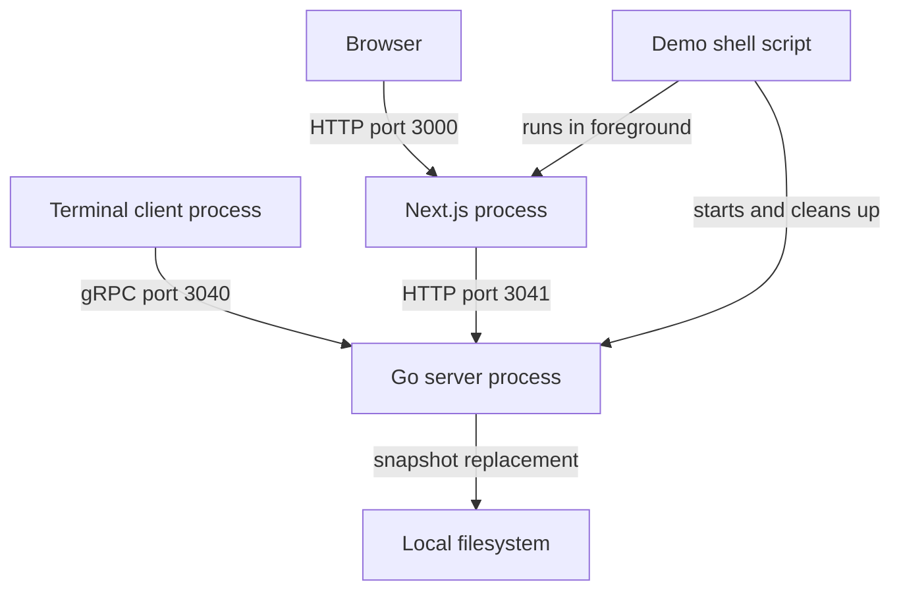

# Architecture

## Overview

The central object is one `database.Engine`, opened once by [server.Run](../../server/main.go#L51). It owns an in-memory catalog, a snapshot path, and a mutex; gRPC and optional HTTP adapters share it. Both call the same `Execute(string) (Result, error)` boundary, so neither transport owns SQL semantics ([engine](../../internal/database/engine.go#L24), [gRPC](../../internal/core/main.go#L28), [HTTP](../../internal/httpapi/handler.go#L16)).

## Components

| Component | Responsibility | Lives in | Talks to |
| --- | --- | --- | --- |
| CLI | Constructs commands, flags, connection and terminal dependencies. | [cmd/](../../cmd/), [map](03-structure.md#cmd) | Server lifecycle, client, shell |
| Server lifecycle | Opens one engine, binds transports, coordinates shutdown. | [server/](../../server/), [map](03-structure.md#server) | Core, HTTP, database |
| gRPC client | Connects, sets deadlines, maps status errors to client errors. | [internal/client/](../../internal/client/), [map](03-structure.md#internalclient) | External wire service |
| Shell | Reads lines, handles local exit commands, renders results/errors. | [internal/shell/](../../internal/shell/), [map](03-structure.md#internalshell) | Client through `Executor` |
| gRPC adapter | Registers wire service, validates requests, formats results/statuses. | [internal/core/](../../internal/core/), [map](03-structure.md#internalcore) | Engine |
| Database | Owns SQL grammar, types, constraints, execution, snapshot format. | [internal/database/](../../internal/database/), [map](03-structure.md#internaldatabase) | Local filesystem |
| HTTP bridge | Accepts JSON queries and exposes a health endpoint. | [internal/httpapi/](../../internal/httpapi/), [map](03-structure.md#internalhttpapi) | Engine directly |
| Studio | Three UI variants, shared query hook, server-side HTTP proxy. | [ui/](../../ui/), [map](03-structure.md#ui) | Go HTTP bridge |

## Boundaries and contracts

- **SQL:** one statement per execution, with an optional final semicolon; unsupported trailing syntax is rejected. The grammar includes CREATE TABLE, DROP TABLE, single-row INSERT, SELECT, UPDATE, DELETE, and one `=` or `IS [NOT] NULL` predicate ([parser](../../internal/database/sql.go#L107), [dispatch](../../internal/database/sql.go#L216), [WHERE](../../internal/database/sql.go#L435)).
- **Engine:** returns structured `Result` fields or a categorized `database.Error`. `Result.Format()` converts that structure into human-readable output; transports currently carry the output text ([result](../../internal/database/result.go#L9), [errors](../../internal/database/errors.go#L9)).
- **gRPC:** external `cool-wire` types carry a SQL string in `Query.Query` and text in `Response.Response`. No generated schema lives in this repository ([pin](../../go.mod#L7), [client invocation](../../internal/client/client.go#L81), [server response](../../internal/core/main.go#L77)).
- **HTTP:** `POST /api/query` accepts `{"query":"SQL"}` and returns `{"output":"text"}` or `{"error":{"code":"...","message":"..."}}`. The Go bridge caps bodies at 64 KiB and rejects unknown fields, extra JSON values, and blank SQL; the Next route validates and reconstructs the query object before forwarding ([handler](../../internal/httpapi/handler.go#L32), [validation](../../internal/httpapi/handler.go#L50), [proxy](../../ui/app/api/query/route.ts#L3)).
- **Health:** `GET /api/health` returns a fixed `status: ok`; it does not query the engine or test future disk writes ([handler](../../internal/httpapi/handler.go#L46)).

Both adapters map typed failures, while unexpected Go errors receive a generic message ([gRPC mapping](../../internal/core/main.go#L80), [HTTP mapping](../../internal/httpapi/handler.go#L88)):

| Database error | gRPC status | HTTP status |
| --- | --- | --- |
| Syntax or type | InvalidArgument | 400 |
| Already exists | AlreadyExists | 409 |
| Not found | NotFound | 404 |
| Constraint | FailedPrecondition | 422 |
| Storage or unknown | Internal | 500 |

## Data model

This diagram models the engine's catalog, not fixed application tables. `users` is only a [demo example](../../ui/app/_demo/use-demo-query.ts#L5).

| Entity | Stored in | Key fields | Defined at |
| --- | --- | --- | --- |
| Catalog | Memory and root JSON object | Format version 1, table-name map | [engine.go:9](../../internal/database/engine.go#L9) |
| Table | Catalog map | Name, ordered columns, positional rows | [engine.go:11](../../internal/database/engine.go#L11) |
| Column | Table schema | Type and column constraints; VARCHAR uses TEXT plus max length | [types.go:28](../../internal/database/types.go#L28), [sql.go:291](../../internal/database/sql.go#L291) |
| Row/cell | Table row slices | One tagged value per schema column | [engine.go:14](../../internal/database/engine.go#L14), [types.go:39](../../internal/database/types.go#L39) |
| Result | Request memory only | Projection, rows, affected count, or message | [result.go:10](../../internal/database/result.go#L10) |

## State and persistence

Opening a missing file creates empty state only in memory. Existing JSON must have the supported version and pass structural validation. SQL mutations validate types, NOT NULL, single-column primary keys, uniqueness, and rune-count VARCHAR limits ([open/load](../../internal/database/persistence.go#L14), [schema validation](../../internal/database/persistence.go#L64), [row constraints](../../internal/database/engine.go#L312), [coercion](../../internal/database/types.go#L91)).

Each mutation takes the exclusive lock, deep-copies the entire database, changes the copy, and persists it before assigning active state. Reads share the read lock, scan memory, and never save a snapshot. There is no delayed flush queue or engine close operation in this lifecycle ([execution](../../internal/database/engine.go#L44), [clone](../../internal/database/engine.go#L330), [shutdown](../../server/main.go#L101)).

Persistence writes a same-directory temporary file, syncs and closes it, then renames it over the snapshot. New directories use `0700`; replacement files use `0600`. Directory sync after rename is best effort and logs failures, so acknowledged writes have a documented power-loss caveat ([save](../../internal/database/persistence.go#L130), [commit comment](../../internal/database/persistence.go#L171)). Shell history is separate at `~/.cooldb_history`; Studio query/result state is component memory ([readline](../../internal/shell/readline.go#L21), [hook](../../ui/app/_demo/use-demo-query.ts#L30)).

## Deployment

These are demo defaults from [scripts/demo.sh:6](../../scripts/demo.sh#L6), not a production deployment manifest. `make build` writes `bin/cool`; the server defaults to host `localhost`, gRPC port 3040, and `~/cooldb/default.cooldb`, while HTTP is disabled unless a positive port is configured ([build](../../makefile#L5), [flags](../../cmd/server.go#L41), [server defaults](../../server/main.go#L33)).

The demo script explicitly binds Go to `127.0.0.1`, passes its HTTP URL to Next through `COOLDB_DEMO_API_URL`, and cleans up the Go child on exit. It does not wait for readiness or pass a loopback `--hostname` to Next. Manual `--host` changes affect both Go listeners; loopback-only operation is a convention rather than enforced access control ([script](../../scripts/demo.sh#L18), [Next launch](../../scripts/demo.sh#L44), [HTTP bind](../../server/main.go#L74)).

## Failure and scale

- **Before snapshot rename:** SQL/constraint or persistence failure leaves active memory unchanged; failed temporary writes are cleaned up ([engine](../../internal/database/engine.go#L59), [save](../../internal/database/persistence.go#L145)). After rename, directory-sync failures warn rather than roll memory back.
- **Corrupt or incompatible snapshot:** startup fails rather than serving malformed rows or silently resetting data ([load](../../internal/database/persistence.go#L25)). Validation is not comprehensive constraint revalidation; see [open questions](README.md#open-questions).
- **Timeouts:** client defaults are 5 seconds to connect and 30 seconds per query; the Next-to-Go proxy has a 10-second timeout. Neither deadline cancels an already-running engine call because `Execute` has no context ([client](../../internal/client/client.go#L18), [proxy](../../ui/lib/cooldb.ts#L12), [core](../../internal/core/main.go#L69)).
- **Transport shutdown:** either transport finishing cancels its sibling. HTTP has a five-second shutdown context; gRPC uses an unbounded graceful stop ([server](../../server/main.go#L91), [core](../../internal/core/main.go#L50)).
- **Access boundary:** gRPC uses an unconfigured server and insecure client credentials; the HTTP wrapper adds headers but no authentication. There is no auth lifecycle to trace ([gRPC setup](../../internal/core/main.go#L47), [client credentials](../../internal/client/client.go#L54), [HTTP headers](../../internal/httpapi/handler.go#L118)).
- **Scaling, inferred from implementation:** readers can coexist, but writes block readers through cloning and disk sync. SELECT and uniqueness checks scan rows; every mutation rewrites all tables, including zero-row UPDATE/DELETE. The mutex protects one Engine, not competing processes; multiple owners of the same path can overwrite each other's state. There is no replication or cross-process lock in [engine execution](../../internal/database/engine.go#L44) or [filesystem persistence](../../internal/database/persistence.go#L130).

Next: [runtime flows](02-flow.md).
