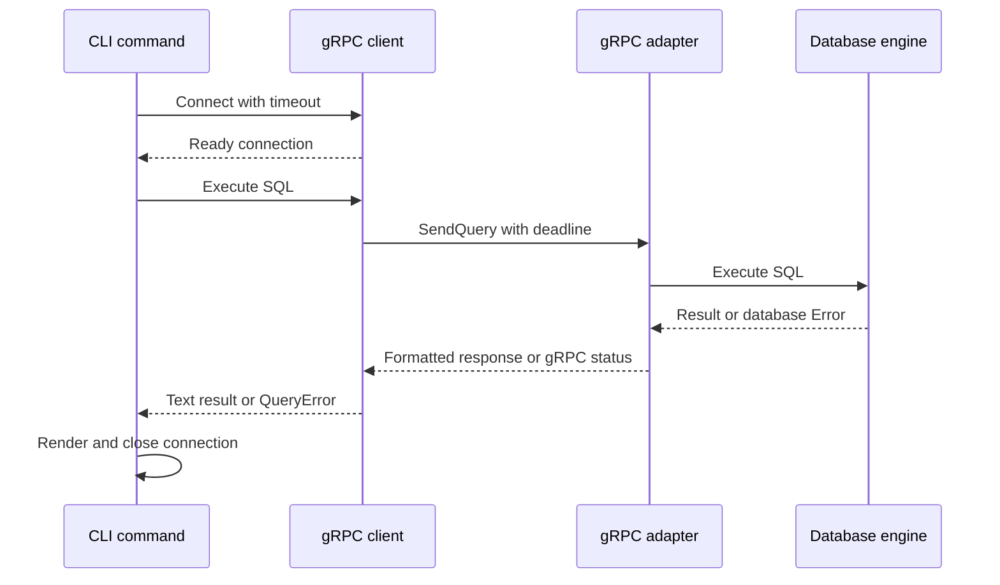
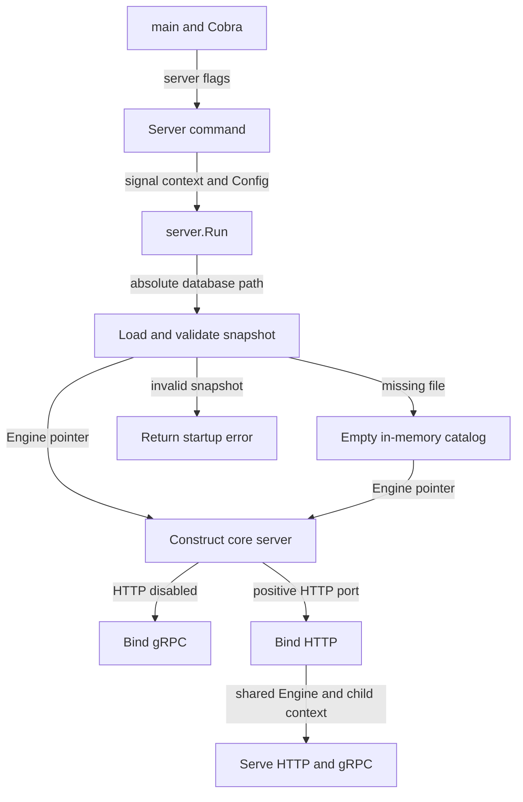
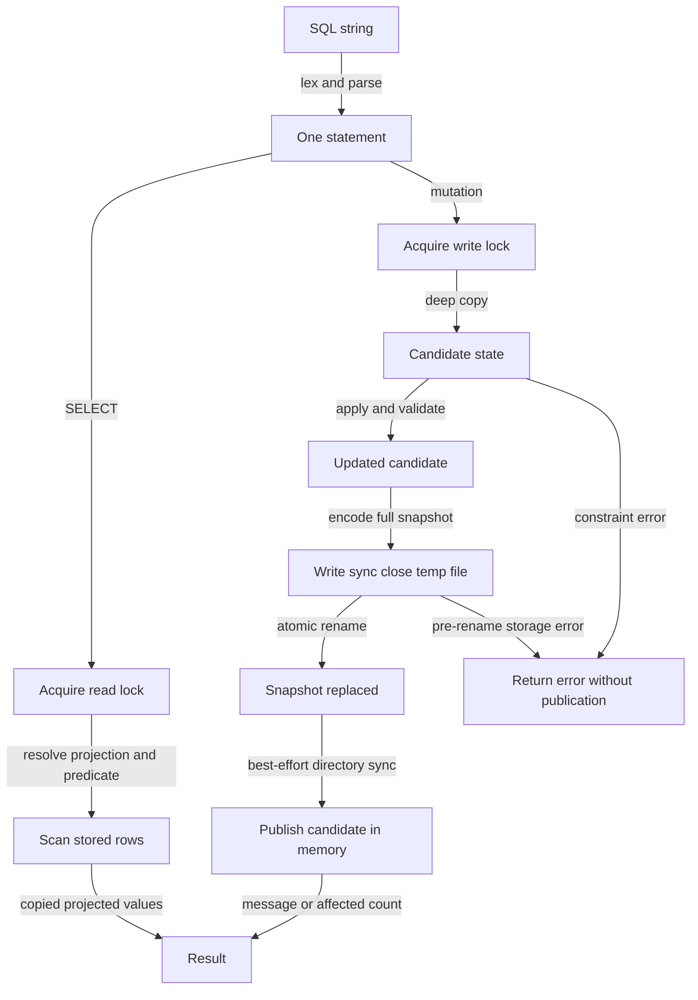
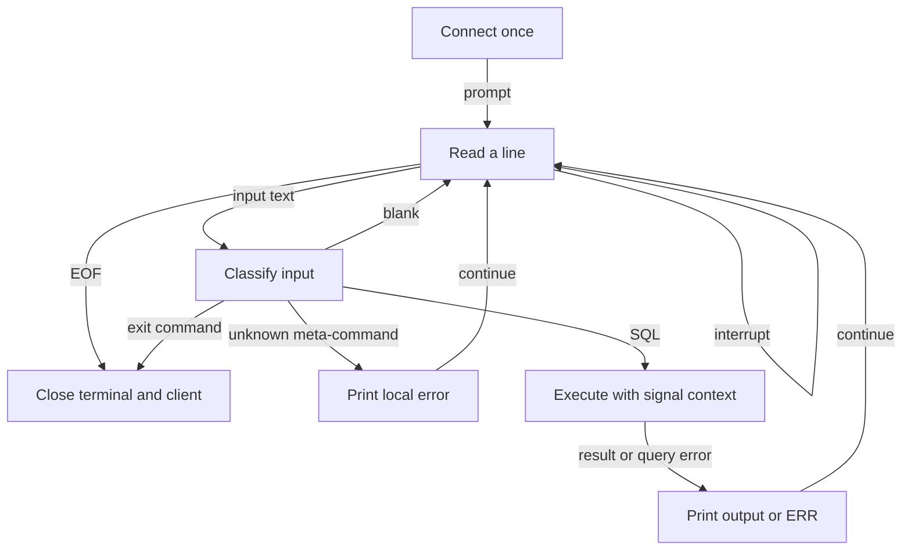
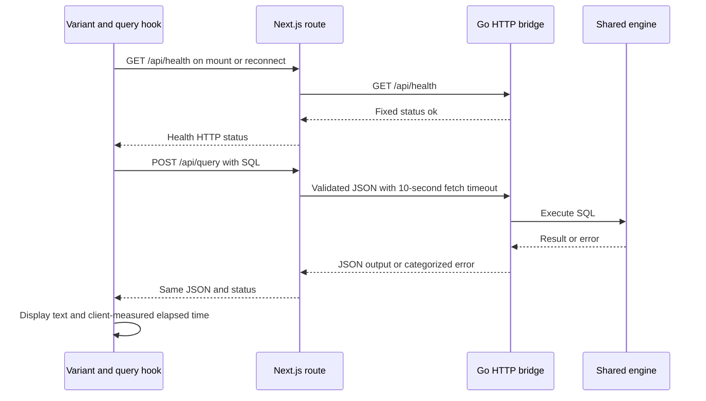
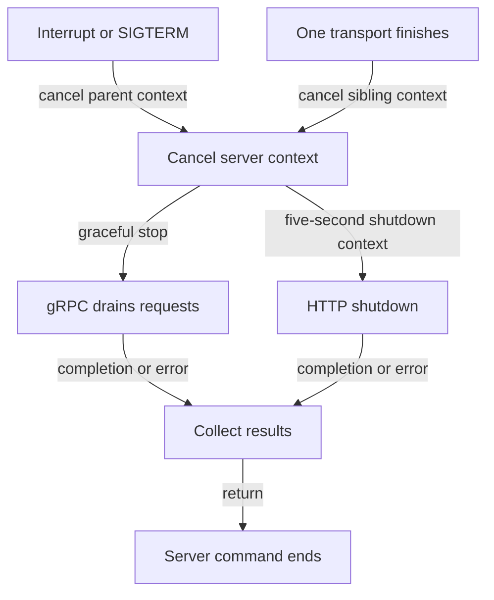
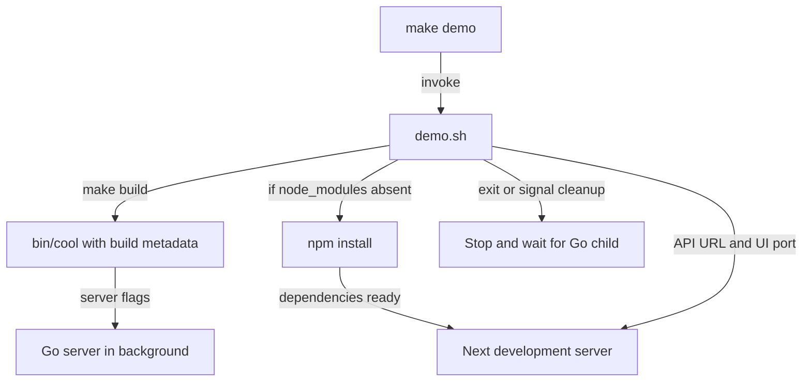

# Flow

## CLI query lifecycle

With a server already started, `cool exec "SELECT * FROM users"` follows this path:

1. **Enter and dispatch.** `main` invokes `cmd.Execute`, which builds Cobra commands; an execution error leads to exit status 1. [main.go:5](../../main.go#L5) · [root structure](03-structure.md#repository-root); [cmd/root.go:89](../../cmd/root.go#L89) · [cmd structure](03-structure.md#cmd).
2. **Acquire SQL.** `exec` accepts at most one argument; otherwise it reads all stdin. Empty input fails before connecting. [cmd/query.go:69](../../cmd/query.go#L69) · [structure](03-structure.md#cmd).
3. **Connect.** Apply defaults, construct a host/port target, create an insecure gRPC client, and wait for Ready within the connection timeout. A failed connection is closed. [internal/client/client.go:51](../../internal/client/client.go#L51) · [structure](03-structure.md#internalclient).
4. **Send.** Trim SQL, establish a query deadline, and call `SendQuery` with `wire.Query`. [internal/client/client.go:74](../../internal/client/client.go#L74) · [structure](03-structure.md#internalclient).
5. **Adapt.** Reject empty requests and already-cancelled contexts, then invoke engine execution. [internal/core/main.go:65](../../internal/core/main.go#L65) · [structure](03-structure.md#internalcore).
6. **Execute.** Parse, read or mutate, and return a structured result; the detailed branch is below. [internal/database/engine.go:44](../../internal/database/engine.go#L44) · [structure](03-structure.md#internaldatabase).
7. **Return.** Format successful results; map database errors to gRPC statuses. The client wraps statuses as `QueryError`. [internal/core/main.go:73](../../internal/core/main.go#L73) · [core structure](03-structure.md#internalcore); [internal/client/client.go:81](../../internal/client/client.go#L81) · [client structure](03-structure.md#internalclient).
8. **Render and clean up.** The command renders text, adding a final newline only if needed, and closes its connection on return. [cmd/query.go:84](../../cmd/query.go#L84) · [cmd structure](03-structure.md#cmd); [internal/shell/shell.go:110](../../internal/shell/shell.go#L110) · [shell structure](03-structure.md#internalshell).

See [error contracts](01-architecture.md#boundaries-and-contracts). A timeout is not proof that a mutation was cancelled.

## Startup

1. **Dispatch and configure.** `server`/`start` reads flags; `--wal` fails immediately. Install SIGINT/SIGTERM cancellation and call the server dependency. [cmd/server.go:13](../../cmd/server.go#L13) · [structure](03-structure.md#cmd).
2. **Resolve state location.** `server.Run` prints a banner, fills defaults, resolves the database path, and calls `database.Open`. [server/main.go:28](../../server/main.go#L28) · [structure](03-structure.md#server).
3. **Restore or initialize.** `Open` loads and validates one JSON snapshot; a missing file creates empty version-1 memory. It installs a persistence closure for later mutations. [internal/database/engine.go:33](../../internal/database/engine.go#L33), [internal/database/persistence.go:14](../../internal/database/persistence.go#L14) · [structure](03-structure.md#internaldatabase).
4. **Wire transports.** Construct the core with that engine; HTTPPort <=0 chooses gRPC alone, otherwise HTTP receives the same engine. [server/main.go:56](../../server/main.go#L56) · [structure](03-structure.md#server).
5. **Listen and serve.** Register the wire service on a fresh gRPC server. For dual transport, bind HTTP first, start its Serve loop, then start gRPC. [internal/core/main.go:40](../../internal/core/main.go#L40) · [core structure](03-structure.md#internalcore); [server/main.go:73](../../server/main.go#L73) · [server structure](03-structure.md#server).

## Engine read and mutation flow

1. **Parse before locking.** Lex SQL, parse a supported statement, optionally consume one semicolon, require EOF. Identifiers become lowercase. [internal/database/sql.go:107](../../internal/database/sql.go#L107), [internal/database/sql.go:547](../../internal/database/sql.go#L547) · [structure](03-structure.md#internaldatabase).
2. **Read branch.** Acquire `RLock`, resolve the table and selected columns, build one predicate matcher, scan in stored order, and copy projected cells into `Result`. [internal/database/engine.go:50](../../internal/database/engine.go#L50), [internal/database/engine.go:162](../../internal/database/engine.go#L162) · [structure](03-structure.md#internaldatabase).
3. **Mutation branch.** Acquire the exclusive lock, clone every table/schema/row, dispatch CREATE/DROP/INSERT/UPDATE/DELETE, and validate values/constraints on the candidate. Errors discard the candidate. [internal/database/engine.go:56](../../internal/database/engine.go#L56), [internal/database/engine.go:71](../../internal/database/engine.go#L71), [internal/database/types.go:91](../../internal/database/types.go#L91) · [structure](03-structure.md#internaldatabase).
4. **Persist.** Create the parent directory if necessary, encode the complete state as indented JSON, write a restricted same-directory temporary file, sync, close, and rename over the target. Pre-rename failure cleans up and returns an error. [internal/database/persistence.go:130](../../internal/database/persistence.go#L130) · [structure](03-structure.md#internaldatabase).
5. **Publish.** Attempt directory sync; after a successful rename a directory-sync failure only warns. Assign `e.state = next`, return the result, and release the lock through the deferred unlock. [internal/database/persistence.go:171](../../internal/database/persistence.go#L171), [internal/database/engine.go:64](../../internal/database/engine.go#L64) · [structure](03-structure.md#internaldatabase).

`UPDATE`/`DELETE` without WHERE match all rows; even zero-row mutations reach persistence. There are no transaction statements or background flushes in this dispatch ([engine.go:71](../../internal/database/engine.go#L71), [matcher](../../internal/database/engine.go#L289)).

## Interactive shell

1. **Open a session.** Connect once, create a host/port prompt and readline input, defer both closures, then run `shell.Runner`. [cmd/query.go:37](../../cmd/query.go#L37) · [structure](03-structure.md#cmd).
2. **Read and classify.** Readline keeps history in the home directory. Runner ignores blank input and interrupts, exits on EOF/exit commands, and reports unknown dot/backslash commands locally. It does not collect multiple lines into a statement. [internal/shell/readline.go:16](../../internal/shell/readline.go#L16), [internal/shell/shell.go:40](../../internal/shell/shell.go#L40), [internal/shell/shell.go:73](../../internal/shell/shell.go#L73) · [structure](03-structure.md#internalshell).
3. **Execute and resume.** Attach signal cancellation to each query, use the same client lifecycle as above, render success or error, and continue. [internal/shell/shell.go:97](../../internal/shell/shell.go#L97) · [shell structure](03-structure.md#internalshell); [internal/client/client.go:74](../../internal/client/client.go#L74) · [client structure](03-structure.md#internalclient).

## Studio query and health flows

1. **Choose the view.** The root page wraps `DemoDashboard` in Suspense. The dashboard selects A/B/C from the URL; each variant creates its own `useDemoQuery` state. [ui/app/page.tsx:5](../../ui/app/page.tsx#L5) · [app structure](03-structure.md#uiapp); [ui/app/_demo/demo-dashboard.tsx:26](../../ui/app/_demo/demo-dashboard.tsx#L26) · [demo structure](03-structure.md#uiapp_demo).
2. **Check connection.** The hook performs a mount health fetch; explicit reconnect calls the same path. The Next health route proxies the Go health response; there is no periodic health polling. [ui/app/_demo/use-demo-query.ts:41](../../ui/app/_demo/use-demo-query.ts#L41) · [demo structure](03-structure.md#uiapp_demo); [ui/app/api/health/route.ts:3](../../ui/app/api/health/route.ts#L3) · [health structure](03-structure.md#uiappapihealth); [internal/httpapi/handler.go:46](../../internal/httpapi/handler.go#L46) · [HTTP structure](03-structure.md#internalhttpapi).
3. **Submit.** Trim editor SQL, skip blank/busy submissions, clear the previous result, start a browser timer, and POST JSON to the same-origin Next route. [ui/app/_demo/use-demo-query.ts:64](../../ui/app/_demo/use-demo-query.ts#L64) · [structure](03-structure.md#uiapp_demo).
4. **Proxy.** Validate a nonempty query string, forward only that field to the configured Go API using no-store and a ten-second timeout, then preserve the upstream payload/status. Fetch or response-decoding failure becomes 503. [ui/app/api/query/route.ts:3](../../ui/app/api/query/route.ts#L3) · [query route structure](03-structure.md#uiappapiquery); [ui/lib/cooldb.ts:12](../../ui/lib/cooldb.ts#L12) · [library structure](03-structure.md#uilib).
5. **Execute directly.** Go enforces its body limit and JSON contract, calls the engine directly, and formats a JSON result/error. This does not pass through gRPC. [internal/httpapi/handler.go:50](../../internal/httpapi/handler.go#L50) · [HTTP structure](03-structure.md#internalhttpapi); [internal/database/engine.go:44](../../internal/database/engine.go#L44) · [database structure](03-structure.md#internaldatabase).
6. **Display.** Store output/error and browser-measured elapsed time, update online/offline state, and clear the running flag. Each variant renders the text in a `pre` element. [ui/app/_demo/use-demo-query.ts:79](../../ui/app/_demo/use-demo-query.ts#L79), [ui/app/_demo/variant-command-center.tsx:137](../../ui/app/_demo/variant-command-center.tsx#L137) · [structure](03-structure.md#uiapp_demo).

## Shutdown

1. **Cancel.** The server command owns the signal context; in dual mode transport completion also cancels the shared child context. [cmd/server.go:30](../../cmd/server.go#L30) · [cmd structure](03-structure.md#cmd); [server/main.go:101](../../server/main.go#L101) · [server structure](03-structure.md#server).
2. **Stop transports.** gRPC invokes `GracefulStop` with no timeout. HTTP invokes `Shutdown` with a five-second context, ignoring its returned error; ordinary `ErrServerClosed` is normalized to nil. [internal/core/main.go:50](../../internal/core/main.go#L50) · [core structure](03-structure.md#internalcore); [server/main.go:91](../../server/main.go#L91), [server/main.go:126](../../server/main.go#L126) · [server structure](03-structure.md#server).
3. **Join and return.** Dual mode receives completion results from both goroutines and returns an error if applicable. There is no final engine flush because mutation persistence is synchronous. [server/main.go:101](../../server/main.go#L101) · [server structure](03-structure.md#server); [internal/database/engine.go:64](../../internal/database/engine.go#L64) · [database structure](03-structure.md#internaldatabase).

## Build and local demo orchestration

1. **Build binary.** `make build` supplies version and UTC build-time linker variables, producing `bin/cool`. [makefile:2](../../makefile#L2) · [root structure](03-structure.md#repository-root); [cmd/root.go:14](../../cmd/root.go#L14) · [cmd structure](03-structure.md#cmd).
2. **Prepare demo.** Resolve ports/path, create the scratch directory, build, and install npm dependencies only if `node_modules` is missing. [scripts/demo.sh:5](../../scripts/demo.sh#L5) · [structure](03-structure.md#scripts).
3. **Run processes.** Start Go in the background, install cleanup traps, then run Next development mode in the foreground with the bridge URL in its environment. [scripts/demo.sh:18](../../scripts/demo.sh#L18) · [script structure](03-structure.md#scripts); [ui/package.json:8](../../ui/package.json#L8) · [UI structure](03-structure.md#ui).

Automated build, race tests, vet, UI audit/lint/build, and scheduled scanning are described in [tooling](04-tech-stack.md#tooling). No database background-job or authentication workflow exists in the [server bootstrap](../../server/main.go#L28).
